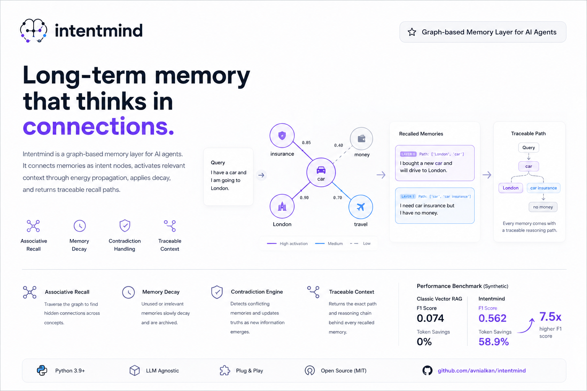

# Intentmind: Graph-based long-term memory for AI agents 🧠

**Associative recall, memory decay, contradiction handling, and traceable context retrieval for persistent AI systems.**

Intentmind is a graph-based memory layer for AI agents. It connects user memories as intent nodes, activates related memories through energy propagation, decays unused context, and returns traceable recall paths instead of flat vector search results.



---

## 🛑 The Problem with Classic RAG

If you are building an autonomous system or an AI agent that lives for more than a single session, you will quickly hit the limits of standard Vector Database RAG wrappers:

1. **Amnesia by Proxy:** Standard RAG relies on overlapping embeddings. If a user talks about buying a *"car"* on Monday, and asks for help with *"insurance"* on Friday, standard RAG will fail to connect them unless the exact keywords or vector spaces strictly align.
2. **Context Bloat:** Vector DBs append data forever. Over time, your agent gets overwhelmed by thousands of trivial, outdated, or conflicting memories, destroying the LLM's accuracy.
3. **Black Box Retrieval:** Why did the system pull a specific chunk? Classic RAG can't tell you the logical path it took.

---

## ⚡ 30-Second Demo

While the core graph logic is language-agnostic, extraction quality is embedding-model dependent. Let's see how Intentmind connects the dots that standard RAG misses.

```python
from intentmind import IntentmindMemory
from intentmind.embeddings import SentenceTransformerEmbedder

# Initialize the memory core
mem = IntentmindMemory(embedder=SentenceTransformerEmbedder(), core_extractor="llm")

# 1. Teach it concepts (Happens naturally during conversation)
mem.add("I need car insurance but I have no money.")
mem.add("I bought a new car and will drive to London.")

# 2. Sometime later, ask a tangential question
result = mem.query("I have a car and I am going to London.")
```

### 🎯 The Output

Instead of just spitting out chunks based on vector distance, Intentmind traverses the graph and returns the **logical path** it took to find the memory:

```python
for item in result["memories"]["items"]:
    print(f"[{item['layer']}] Path: {item.get('path')} -> {item['text']}")

# Output:
# [0] Path: ['London', 'car'] -> I bought a new car and will drive to London.
# [1] Path: ['car', 'car insurance'] -> I need car insurance but I have no money.
```
*Notice how it organically jumped from `car` to `car insurance` to warn the agent that the user has no money for the London trip!*

---

## 🌟 Why Intentmind is Different (The Cognitive Architecture)

Intentmind doesn't just store documents; it builds a **dynamic associative memory graph with energy-based activation, decay, reinforcement, and traceable recall paths**. It acts as a living, breathing cognitive architecture.

### 1. Associative Recall (Semantic Drift Recovery)
When data is ingested, Intentmind extracts core concepts (nodes) and connects them (edges). When a user mentions a concept, the system doesn't just do a vector search—it **traverses the graph**. `CognitiveField` propagates energy through the graph to find hidden associations (Layer 0, 1, 2, 3) and applies strict **Token Budgeting** to keep the context window pristine.

### 2. Biological Forgetting (Energy & Decay)
Every time a memory is recalled, its connection strengthens (like human synapses). Unused, irrelevant, or noisy memories slowly decay and are eventually "forgotten" (archived). This prevents context bloat.

### 3. Language-Agnostic Root Intelligence (Lemmatization)
To prevent "Intent Explosion" (e.g. `car`, `cars`, `my car` all becoming separate nodes), Intentmind uses a proprietary **Language-Agnostic Soft-Match Algorithm**. It combines High Vector Similarity (>82%) with Lexical Overlap (Prefix-matching >60%) to organically merge inflections and typos into aliases of a single root intent, without needing language-specific NLP libraries.

### 4. Dynamic Edge Confidence (State Machine)
Graphs easily turn into useless spaghetti if edges are formed too quickly. Intentmind features a rigorous **Edge State Machine** (`Candidate` -> `Weak` -> `Active`). Edges are evaluated based on Co-occurrence Frequency, Semantic Consistency, Temporal Recurrence, and Domain Alignment. A passing mention creates a mere "Candidate" edge which doesn't pollute recall until it is corroborated!

### 5. Semantic Consolidation & Contradiction Engine
Intentmind's background `tick()` lifecycle actively monitors the `episodic` memory pool. As patterns emerge (e.g. "User drank espresso", "User hates filter coffee"), the **Consolidation Engine** automatically uses an LLM to synthesize **Semantic Facts** ("User likes espresso, dislikes filter coffee") while archiving the raw events. If a user later says "I actually love filter coffee now," the **Contradiction Engine** catches the conflict, decays the old semantic fact, and solidifies the new truth.

---

## 🎯 Use Cases

- **Autonomous Agents & AI Personas:** Give your AI agents long-term, evolving memory. As they interact with the world, their internal cognitive graph adapts, making them highly personalized and context-aware.
- **Persistent Copilots:** Build customer support bots, coding assistants, or personal companions that remember user preferences seamlessly over years of interaction without polluting the LLM context window.
- **Complex Simulators:** Drive simulations where multiple entities negotiate, learn, and forget based on cognitive connections.

---

## 📊 Performance Benchmarks

In our synthetic semantic drift benchmarks comparing classic vector search against Intentmind on associative multi-hop recall:

| System | F1 Score | Token Savings |
| :--- | :--- | :--- |
| Classic Vector RAG | 0.074 | 0% |
| **Intentmind** | **0.562** | **58.9%** |

*(Intentmind achieves ~7.5x higher F1 score by navigating orthogonal concepts while saving context window space via Layered Token Budgeting).*

---

## 🚀 Installation & Integration

```bash
# Core package
pip install intentmind

# With recommended production dependencies (FAISS, SentenceTransformers, OpenAI)
pip install "intentmind[all]"
```

### LangChain Adapter
Drop Intentmind straight into your existing LangChain pipelines as a custom, ultra-smart Retriever.
```python
from intentmind.integrations.langchain import IntentmindRetriever

retriever = IntentmindRetriever(memory=mem)
docs = retriever.invoke("How does the energy model work?")
```

### Persistence (Save & Load)
Save the entire brain (vectors, nodes, edges, decay states) to disk instantly.
```python
mem.save("my_agent_brain.json")
mem = IntentmindMemory.load("my_agent_brain.json")
```

---

## 🤝 Contributing & License

Intentmind is released under the **Intentmind Fair-Code License**. 

- **Personal & Academic Use:** Completely free! You can use, modify, and experiment with Intentmind for your personal projects, academic research, or hobby apps.
- **Commercial Use:** If you plan to use Intentmind in a commercial product, SaaS, or any revenue-generating service, you **must** obtain prior written consent or a commercial license. 

We welcome contributions for new embedders, LLM adapters, and vector store integrations! Build the future of AI memory with us.
